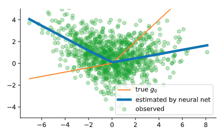
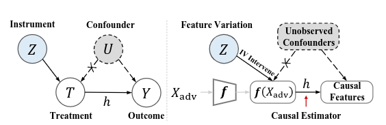
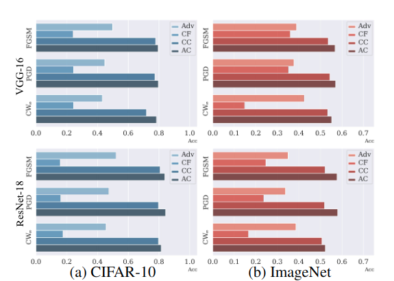

# 对抗训练中的因果推断  

## 一、因果推断  
标准的监督学习总是对数据之间的相关性进行建模，与之截然相反的是，因果推断旨在预测数据中未见的反事实干预的结果。例如，当想要估计坚持服用药物对预防心脏病的影响时，监督学习可能高估了真实的效果，因为良好的依从性也和健康意识密切相关，因此也会对心脏健康产生影响。  

图1显示了这种类型的一个简单示例，标准神经网络(蓝色)如何无法正确估计真实的治疗响应曲线(橙色)。出现这种问题的原因是，监督学习总是假设残差独立于特征。工具变量法为因果关系的识别提供了另一种方法。如果我们可以在另一个工具变量中寻找到影响Treatment而不影响结果的潜在实验，那么可以使用这个工具变量来推断因果效应。由于它们可以在温和的假设下分析自然实验，因此工具变量法已成为各种领域实证研究中最广泛使用的工具之一。GMM，又称广义矩估计，是一种在计量经济学中广泛流行的方法，它使用工具变量法隐含的矩条件来有效地估计因果参数。    
接下来首先介绍一下广义矩估计（GMM）方法，该方法假设数据由下列关系生成：  
$$Y = g_0(X) + ϵ \tag{1}$$  
其中，$E[ϵ] = 0, E[ϵ^2] \lt ∞,E[ϵ | X] \ne 0, g_0(X) \ne E[Y|X]$，同时，假设有工具变量$Z$，满足:  
$$E[ϵ |Z]=0 \tag{2}$$  
要求$P(X|Z) \ne P(X)$。  
目标是从参数化的函数族G识别出响应函数$g_0$。
广义矩估计李永乐$\theta_0$满足的矩约束条件，给定Z的函数$f_1,...,f_m$，等式2指明了$E[f_j(Z) ϵ]=0$，所以可以得到：  
$$\phi(f_1,θ_0)=...=\phi(f_m,θ_0)=0,其中\phi(f,θ) = E[f(Z)(Y-g(X;θ))] \tag{3}$$  

通常可以假设通过这m个矩约束可以唯一的确定$θ_0$。GMM会考虑这些矩约束的实际计算形式$\phi_n(f;\theta) = \frac{1}{n} \sum_{i=1}^n f(Z_i)(Y_i-g(X_i; θ))$，同时因为满足0不太现实，所以转而追求最小化:  
$$ \hat{\theta}^{GMM} ∈ argmin_{\theta \in Θ} ||(ϕ(f_1;θ),...,ϕ(f_m;θ))||^2 \tag{4}  $$
但是计算这样的最小化函数就会显而易见的出现最小化问题，使用任何未加权的向量范数可能导致显著的低效率，所以产生最小方差估计的最小全中实际上是由协方差矩阵的逆矩阵的加权给出的，同时使用该权重回产生最小的渐进方差：  
$$ ||v||^2_{\breve{\theta}} = v^T C_{\breve{θ}}^{-1}v, where [C_θ]_{jk} = \frac{1}{n} \sum_{i=1}^n f_j(Z_i) f_k(Z_i)(Y_i-g(X_i;θ))^2  \tag{5}$$

然而，当我们使用过多的矩条件时，GMM算法会失败。

## 二、深度网络中的广义矩估计  
利用具有最优权重的高效GMM的新变分重新表述，Bennett等人在NIPS2019中提出了深度广义矩估计(DeepGMM)使得神经网络也可以使用工具变量估计。具体来说，他们重构了具有最优逆方差加权的GMM，使得DeepGMM可以有效的控制非常多的矩约束。 DeepGMM适用于高维Treatment X和工具变量Z，以及复杂的因果和相互作用效应。DeepGMM是由预测函数和评价函数之间的平滑博弈的解给出的。   

设实值函数$f(Z)$定义在向量空间$V$上，对于任意$θ$，$\phi_n(f;θ)$是V上的一个线性函数，同时有：  
$$C_θ (f,h) = \frac{1}{n} \sum_{i=1}^n f(Z_i)h(Z_i)[Y_i - g(X_i;θ)]^2$$  
定义V的子集F，设定一个目标函数如下：  
$$\Phi_n(θ;F,\breve{θ}) = sup_{f\in F} \phi_n(f;\theta) - \frac{1}{4}C_{\breve{\theta}}(f,f) \tag{6}$$  
同时有引理1：  
引理1：$$||v||^2_{\breve{\theta}} =\Phi_n(θ;F,\breve{θ}) $$  

故而有推论1:  
推论1: $$ \hat{\theta}^{GMM} \in argmin_{θ \in  Θ} \Phi_n(θ;F,\breve{θ}) \tag{7}$$  

重新设定$F = \{f(z;t):t\in T \}, G=\{g(x;\theta): \theta \in Θ\}$  
$$\hat{\theta}^{DeepGMM} \in argmin_{\theta \in Θ} sup_{t \in T} U_{\breve{θ}}(\theta,t)  \\ 
其中, U_{\breve{\theta}}(\theta,t) = \frac{1}{n} \sum_{i=1}^n f(Z_i;t)(Y_i-g(X_i;\theta)) - \frac{1}{4n} \sum_{i=1}^n f^2(Z_i;t)(Y_i-g(X_i;\breve{θ}))^2 \tag{8}$$  

## 三、对抗网络中的广义矩估计  
因果推断应用于对抗攻防，基于以下观点：  
对抗训练网络中鲁棒特征和非鲁棒特征都普遍存在，但是对抗样本上的非鲁棒特征会引起意想不到的误分类。  

早期的工作主要集中在分析对抗性训练学习方案中的对抗性样本和目标标签之间的关联，这是典型的监督学习。这种分析容易在学习关联中诱发虚假相关(即统计偏差)，因此在可能存在偏差的观点(例如，过度线性，统计波动，频率信息和非鲁棒特征)的情况下，无法解释对抗性脆弱性的真正起源。

为了从因果关系的角度解释对抗性脆弱性的来源，并推断出真正的对抗性因果关系，我们需要采用一种以干预为导向的方法(即因果推理)，该方法可以估算因果关系，而不仅仅是分析对抗样本的给定数据群体的关联。  
  
如图所示，定义因果估计模型$h$来推断Treatment(T)和Outcome(Y)之间的因果关系。如果存在了未知的混杂因素U，这可能导致产生虚假的相关，从而阻碍因果估计模型估计T和Y之间的因果关系。未知的混杂因素U在对抗设置中很容易引起对对抗起源的模糊解释，从而在对抗样本与其目标标签之间产生虚假的相关性。 为了揭示对抗性因果关系，我们首先需要干预来自网络的中间特征表示，在不考虑未知的混淆因素U的前提下，关注真正影响对抗鲁棒性的因素，而不是模型预测。   

为此，我们将工具变量$Z$定义为神经网络在对抗样本和自然样本之间的特征空间中的特征变化，其中变化Z源于图像域中的对抗扰动，使得Z为给定的自然特征派生出对抗特征T。  

一旦我们在对抗性示例中找到与因果关系相关的特征表示,我们把它们命名为因果特征Y。
Y的作用是存在对抗性扰动的情况下，它可以鼓励预测目标标签的鲁棒性。  

定义工具变量Z：  
$$Z = f_l(X_ϵ)-f_l(X) = F_{adv}-F_{natural} \tag{9}$$  
其中$f_l$代表了模型中第l个中间层，$X_ϵ$代表了对抗样本，我们希望揭示对抗性特征Fadv如何真正估计因果特征y。设定$T=F_{adv}$，并且将反事实设定为$F_{natural}+g(Z)$。  
定义$T' = T_{CF} -F_{natural} = g(Z)$  
设定$Y = Y'+F_{natural} = h(T') +F_{natural}$。  
重构GMM得到下式为：
$$min_{h \in H} max_{g \in G} E_Z[E_{T'}[ϕ_{T'}(h)|Z]g(Z)] = E_Z[ϕ_{T'|Z}(h)g(Z)] \tag{10}$$  
其中:$\phi_{T'|Z}(h) = Y'-h(T')$  
然而现在依然没有$Y'$的计算形式，因此构造$G_log$来作为$Y'$的表示。
构造:$Ω(w) = log f_{l+}(F_{natural} + w)$。    
修改公式10为:  
$$min_{h \in H} max_{g \in G} E_Z [ϕ_{T'|Z}^Ω (h) ⋅(Ω ⊗ g)(Z)] = E_Z[\{G_{log} - (Ω ⊗ h)(T')\} \cdot (Ω ⊗ g)(Z)] \tag{11}$$  

考虑到泛化差距的控制，最终目标函数为:  
$$ min_{h \in H} max_{g \in G} E_Z[ϕ^Ω_{T'|Z}(h)\cdot (Ω ⊗ g)(Z)] - |E_Z[Z-g(Z)]|^2 \tag{12}$$  

## 四、检验  
定义:  
Adversarial Feature(Adv): $F_{natural} + Z$  
CounterFactual Feature (CF): $F_{natural} + g(Z)$  
Counterfactual Causal Feature (CC): $F_{natural} + (h ⊗ g)(Z)$  
Adversarial Causal Feature (AC):$F_{natural} + h(Z)$  
  
可以看出AC的对抗鲁棒性最高，所以因果特征高度有效。  
设定如下损失函数以将因果特征引入对抗训练：  
$$δ_{causal} = argmin D_{KL} (f_{l+}(F_{AC} || f_{l+}(F_{adv}))) \tag{13}$$