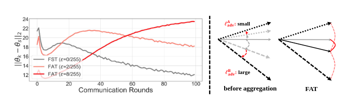
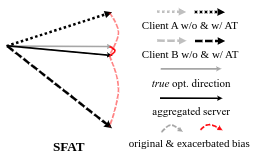

# 松弛联邦对抗训练  

在异构数据的联邦学习框架中，进行对抗训练的主要困难是由异构数据的局部训练所引起的偏差优化。对抗训练，与标准训练的关键区别在于使用内最大化来生成对抗数据，它追求更好的对抗鲁棒性。在联邦学习中，客户端上所进行的对抗训练，其所追求对抗鲁棒性的内部最大化会加剧本地客户端的数据异质性。  
对抗数据继承了优化偏差，因为它的生成是基于有偏差的局部模型。随着对抗强度的增加，即当对抗训练试图通过更强的对抗生成获得更强的鲁棒性时，观察到异质性被加剧(由图1左侧的客户端漂移表示)。在图1的右侧，我们展示了两个客户端(即客户A和B)的聚合过程。通过对本地数据的对抗训练，每个客户端的优化偏差被加剧。这可能导致更严重的异质性和较差的收敛性。因此，需要一种新的机制来防止不利于FAT收敛的异质性加剧。  
  

## 松弛优化机制  
如前所述，由于数据异质性的加剧，对抗训练的内最大化与联邦学习不相容。为了解决这一问题，一种可能的方法是建立一个中介函数，可以缓解异质性效应的加剧，同时渐进地接近原始目标的目标，以追求对抗鲁棒性。  
根据这种直觉，我们考虑内部最大化的松弛，以防止优化偏差的加剧，如图2所示。形式上，我们将对抗训练中的内最大化分解为与联邦学习中的K个clients相对应的独立K种群，并将其松弛为下界α。  

$$L_{AT} = \frac{1}{N} \sum_{n=1}^N max_{\widetilde{x}_n \in B_ϵ [x_n]} l(f_θ(\widetilde{x}_n),y_n) \\ 
=\sum_{k=1}^K \frac{N_k}{N} (\frac{1}{N_k}\sum_{n=1}^{N_k} max_{\widetilde{x}_n \in B_ϵ[x_n]}) l(f_θ(\widetilde{x}_n^k),y_n^k) \\ 
\ge (1+ \alpha) \sum_{k=1}^{\hat{K}} \frac{N_{ϕ(k)}}{N} L_{\phi(k)} + (1-α)  \sum_{k=\hat{K}+1}^K \frac{N_{\phi(k)}}{N} L_{\phi(k)} = L^α(\hat{K}) \tag{1}$$  

其中，$\phi$是一个函数，它以升序将索引映射到由$\frac{N_k}{N}L_k$。 请注意，$\phi()$是一个非参数的辅助化操作，不需要进行梯度的反向传播，直觉上是放宽原始目标以减轻异质性恶化，例如离散优化中的经典连续松弛。  
我们还在实验中讨论了 α-slack 的反向操作，它追求上限，但它进一步加剧了异质性。